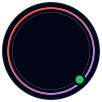

  <!-- Avatar Indah dari Aset lokal -->
  

    
  

  # Halo Dunia, Saya Thomas Alfareno Ananta Nugraha! 👋

  ### *🖥️ Informatics Engineering Student | Tech Enthusiast*

  📍 **Surabaya, East Java, Indonesia**

  <!-- Counter Kunjungan Profil -->
  

    
  

  <!-- Simulasi Terminal Typewriter Animasi Penuh -->
  

    
  

  <!-- Sistem Telemetri Live & Status Node -->
  

    
  

  

    
    
    
  

---

### 💫 Tentang Saya

Mahasiswa Teknik Informatika ITS Surabaya (FTEIC) angkatan 2024 yang antusias dengan backend engineering, sistem web konvensional, serta deep learning dari dasar. Saat ini fokus ngulik arsitektur Transformer dan training model decoder-only dari nol memakai PyTorch, sekaligus membangun sistem web interaktif berbasis PHP/MySQL dan JavaScript. Sering menghabiskan malam dengan terminal dan secangkir kopi hitam.

#### 🎓 Perjalanan Akademik
- 🏫 Mahasiswa aktif program studi **Teknik Informatika (Informatics Engineering)**
- 🏛️ **Fakultas Teknologi Elektro dan Informatika Cerdas (FTEIC)**
- 🎓 **Institut Teknologi Sepuluh Nopember (ITS)** (ITS Surabaya)

### 🚀 Sorotan Singkat

- 🌱 **Sedang mempelajari:** Deep Learning Optimization on Cloud/TPU, PHP Architecture, and High-Performance MySQL query optimization
- 📂 **Sedang mengerjakan:** SpaceAX Conversational AI Engine & High-Performance Indonesia KBBI Dictionary Integration
- ⚡ **Fakta Unik:** Suka berdiskusi teknologi sambil menyeruput secangkir kopi hangat!

### 🛠️ Teknologi Kunci & Keahlian

  
  
  
  
  
  
  
  
  

---

### 📂 Proyek Kode Terbuka Pilihan

Berikut adalah beberapa arsitektur saraf, mesin percakapan, dan pengembangan sistem cerdas yang saya kembangkan dari awal:

#### 🛠️ [**SpaceAX-AI**](https://github.com/thomasalfareno/SpaceAX-AI)
> Conversational AI Engine berbasis Transformer decoder-only yang dirancang untuk dapat belajar mandiri secara real-time dari internet, mengingat konteks percakapan dengan SQLite, memiliki kepribadian emosi, dan terintegrasi leksikon KBBI.

- **Teknologi Utama:** `PyTorch`, `Tokenizers`, `SQLite`, `DuckDuckGo Search`, `BeautifulSoup4`
- **Fitur Utama:**
  - Arsitektur modular (core model, memory, learning, personality, training)
  - Integrasi database KBBI (~112k entri) untuk pengayaan kosa kata bahasa Indonesia
  - Short/Long-term memory berbasis SQLite Vector Store
  - Pencarian internet dinamis dengan DuckDuckGo Search API

#### 🛠️ [**SpaceAX-AI-BETA**](https://github.com/thomasalfareno/SpaceAX-AI-BETA)
> Mesin percakapan Transformer decoder-only modular dengan optimasi ProMax scaling (~1.2B hingga ~8B parameter) yang dilatih sepenuhnya dari nol (bukan pre-made model dari HuggingFace).

- **Teknologi Utama:** `PyTorch`, `NumPy`, `BPE Tokenizer`, `Rich Terminal UI`
- **Fitur Utama:**
  - Skala ProMax Parameter (ProMax 1B, ProMax 4B, dan ProMax 8B)
  - VRAM-Fitting otomatis untuk optimalisasi training hardware hemat
  - Sistem filter output 3 tingkat (validator Ketat, Longgar, Draft)
  - Normalisasi bahasa gaul/slang ke bahasa baku secara dinamis

#### 🛠️ [**SpaceAX-AI-BETA-TPU**](https://github.com/thomasalfareno/SpaceAX-AI-BETA-TPU)
> Versi performa tinggi dari SpaceAX-AI ProMax yang dioptimalkan khusus untuk akselerasi Google Cloud TPU v5e-1 menggunakan PyTorch/XLA dengan native bfloat16.

- **Teknologi Utama:** `PyTorch/XLA`, `TPU v5e-1`, `Adafactor`, `Google Cloud VM`
- **Fitur Utama:**
  - Akselerasi performa tinggi menggunakan PyTorch/XLA + PJRT_DEVICE=TPU
  - Native bfloat16 precision training untuk alokasi memori HBM efisien
  - Automated verify-tpu script untuk diagnosa runtime tensor cepat
  - Optimizer Adafactor + gradient checkpointing untuk penanganan model 8B

---

### 📊 Statistik Aktivitas GitHub

  <table border="0">
    <tr>
      <td>
        
      </td>
      <td>
        
      </td>
    </tr>
    <tr>
      <td colspan="2" align="center">
        
      </td>
    </tr>
  </table>

